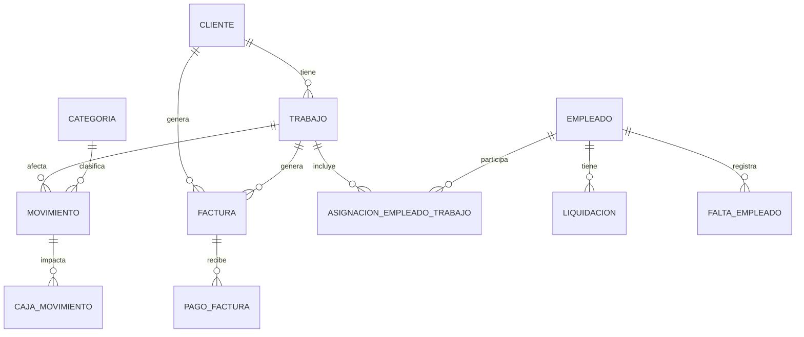

# Proyecto Pablito: Especificaciones Técnicas
## Documentación de Arquitectura e Implementación

### 1. Arquitectura del Sistema
Se implementará una **Clean Architecture (Arquitectura Limpia)** simplificada para garantizar el desacoplamiento y la facilidad de prueba.

*   **Core**: Entidades de dominio y reglas de negocio puras.
*   **Application**: Casos de uso, DTOs y lógica de orquestación.
*   **Infrastructure**: Implementación de persistencia (EF Core), acceso a archivos y servicios externos.
*   **UI (Avalonia)**: Interfaz de usuario multiplataforma siguiendo el patrón **MVVM**.

### 2. Stack Tecnológico
*   **Framework**: .NET 10 (C#)
*   **UI**: Avalonia UI 11+ (con CommunityToolkit.Mvvm)
*   **Base de Datos**: SQLite (Local)
*   **ORM**: Entity Framework Core 9+
*   **Validaciones**: FluentValidation
*   **Logging**: Serilog (Sinks: Console, File)
*   **Mapeo**: Mapster (para conversión entre Entidades y DTOs)
*   **Reportes**: QuestPDF (PDF), ClosedXML (Excel)

### 3. Modelo de Datos (Entidades)
El núcleo del sistema se basa en las siguientes entidades:

*   **Movimiento**: Id, Fecha, Tipo (Enum), Monto, Moneda, FKs (Trabajo, Cliente, Empleado, Factura).
*   **Cliente**: Datos fiscales y de contacto.
*   **Trabajo**: Nombre, ClienteId, Fechas, Estado, Presupuesto.
*   **Factura**: Número, ClienteId, MontoTotal, Estado (Calculado).
*   **Empleado**: Nombre, TipoPago (Enum), TarifaBase.
*   **Liquidacion**: EmpleadoId, Período, Montos (Base, Adelantos, Faltas), TotalFinal.
*   **Categoria**: Jerarquía para clasificación de gastos e ingresos.

### 4. Diagrama Entidad-Relación (Mermaid)

### 5. Plan de Implementación (Fases)
1.  **Fase 0 - Setup**: Estructura de solución y proyectos .NET.
2.  **Fase 1 - Núcleo**: Movimientos y categorías.
3.  **Fase 2 - Clientes/Facturación**: CRUD de clientes y control de deudas.
4.  **Fase 3 - Empleados**: Liquidación y gestión de faltas.
5.  **Fase 4 - Trabajos**: Rentabilidad por proyecto.
6.  **Fase 5 - Dashboard**: Vista general y alertas.
7.  **Fase 6 - Extras**: Adjuntos y multi-moneda.
8.  **Fase 7 - Exportaciones**: PDF, Excel y CSV.

### 6. Consideraciones de Infraestructura
*   **SQLite**: Se utilizarán conversiones de tipo para manejar `decimal` como `double` debido a limitaciones nativas de SQLite.
*   **Migrations**: Uso de EF Core Migrations desde el inicio para evolución del esquema.
*   **Dependency Injection**: Uso extensivo del contenedor de .NET para servicios y repositorios.
